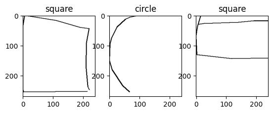
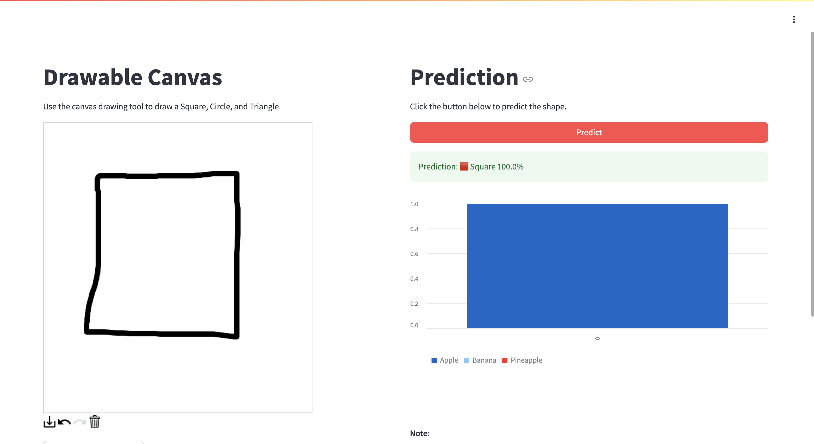

## Doodle Shape Classification
This repository contains the code for the Doodle Shape Classification project. The project aims to classify doodles into 3 different categories: Circle, Triangle, and Square. The dataset used for this project is the [Quick, Draw! Dataset](https://quickdraw.withgoogle.com/data). The dataset contains 50 million drawings across 345 categories. The dataset was preprocessed to extract the drawings of the 3 categories mentioned above. The drawings were then converted to images and used to train a Convolutional Neural Network (CNN) model. The model was trained using the TensorFlow framework. The trained model was then used to classify new doodles into one of the 3 categories.
<br><br>
[](https://doodlefruits.streamlit.app/)

## Demo
You can access the demo using the following link: [Doodle Shape Classification](https://doodlefruits.streamlit.app/)
[](https://doodlefruits.streamlit.app/)


## Usage Instructions
1. Clone the repository.
2. Run the `app.py` file to start the application.
```bash
streamlit run app.py
```
3. Draw a doodle in the canvas provided.
4. Click the `Classify` button to classify the doodle.
5. The predicted class will be displayed below the canvas.


## Contact Us
* shahrudra876@gmail.com<br>
* [linkedin](https://www.linkedin.com/in/rudra-shah-b044781b4/)<br>
* [Instagram](https://www.instagram.com/rudra_shah_/)
